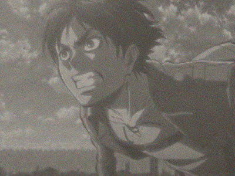
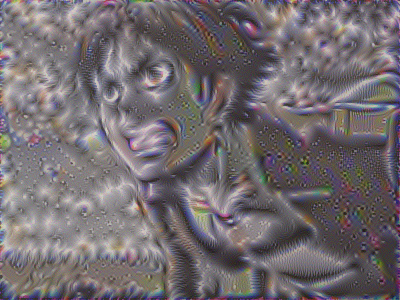
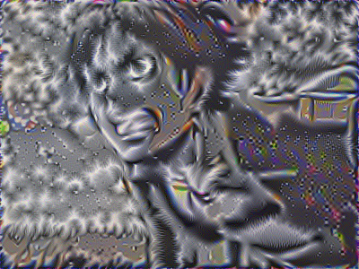
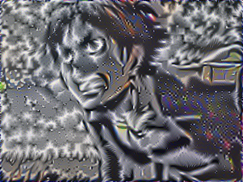
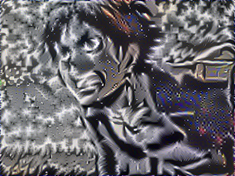
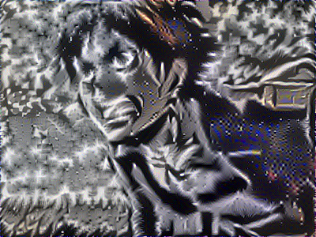
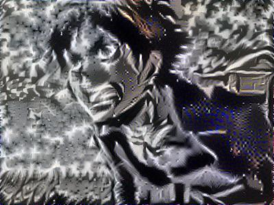
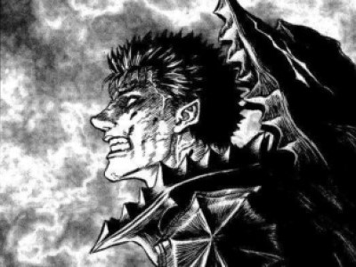

# Style_Transfer_with_Berserk

Time to merge two of my favorite comics together! Berserk's apocalyptic style fits the theme of Attack on Titan.

This is my personal projects for the deep learning course.

Instructor: https://www.andrewng.org/

# Outcome
    

    

    

    

# Pre-trained model VGG
https://www.dropbox.com/s/bplbxdt4aa5hyli/pretrained-model.rar?dl=0

# Disclaimer
All the code base, screenshot, and images, are taken from, unless specified https://www.coursera.org/specializations/deep-learning
