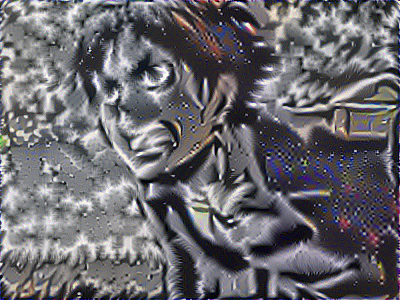
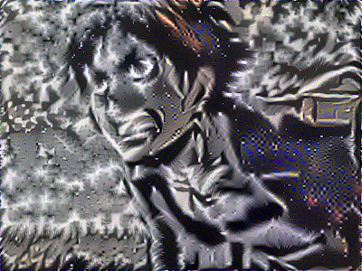

# Style_Transfer_with_Berserk

Time to merge two of my favorite comics together! Berserk's apocalyptic style fits the theme of Attack on Titan.

This is my project for the deep learning course.

Instructor: [Andrew NG] https://www.andrewng.org/

# Outcome
    

    

    

# Pre-trained model VGG
https://www.dropbox.com/s/bplbxdt4aa5hyli/pretrained-model.rar?dl=0

# Acknowledgement
All the code base, screenshot, and images, are taken from, unless specified, https://www.coursera.org/specializations/deep-learning
